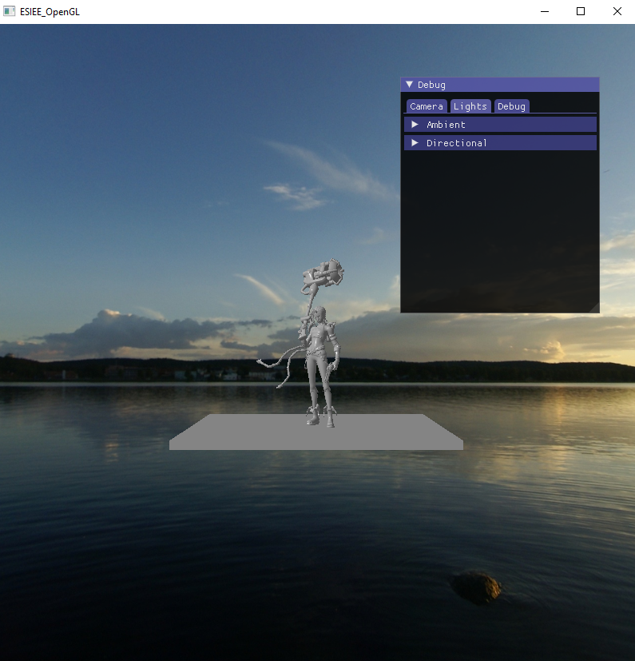
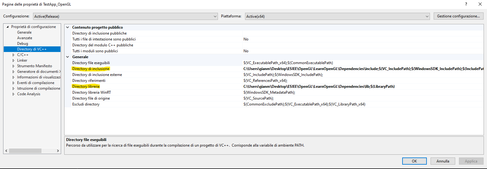

# OpenGL-Workbench
The aim of the project is to build a workbench to test the most sofisticated OpenGL functionalities and its effect on object. 
The structure of the window is pretty simple, you will be provided with you scene closed inside a skybox and a debug window with all the effects and parameters that the workbench allows you to modify.

Inside the code there are more scene already prepared that you can try. To use them just uncomment the line in the SetupScene() function and compile again the code.

# Instruction
The project has been developed using Visual Studio 2019 (compatible with newer and older version). 
In order to compile again and run the code, you may need to change the include and lib path on your project.

Then you can run the project directly from visual studio or from the .exe generated by the IDE. Remember that in order to run the executable you need to stay in a directory with also the Assets directory on it.
In the build uploaded there is already a fully functional .exe, so unless you want to view a new scene there is no need to compile again everything.

## Movement
To move the camera:
- use your scrool wheel to zoom-in or zoom-out
- hold the scrool button and move the mouse to rotate the camera

# Credits
Developed by Gianmarco Tedeschi for the Computer Graphics & OpenGL course at ESIEE
